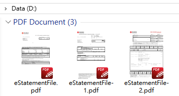
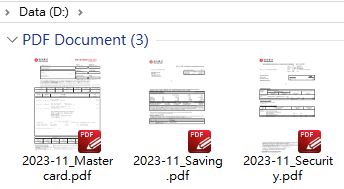
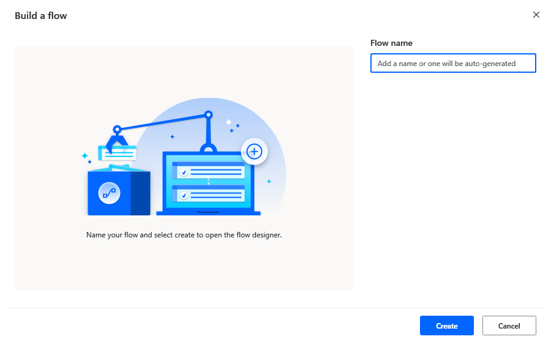
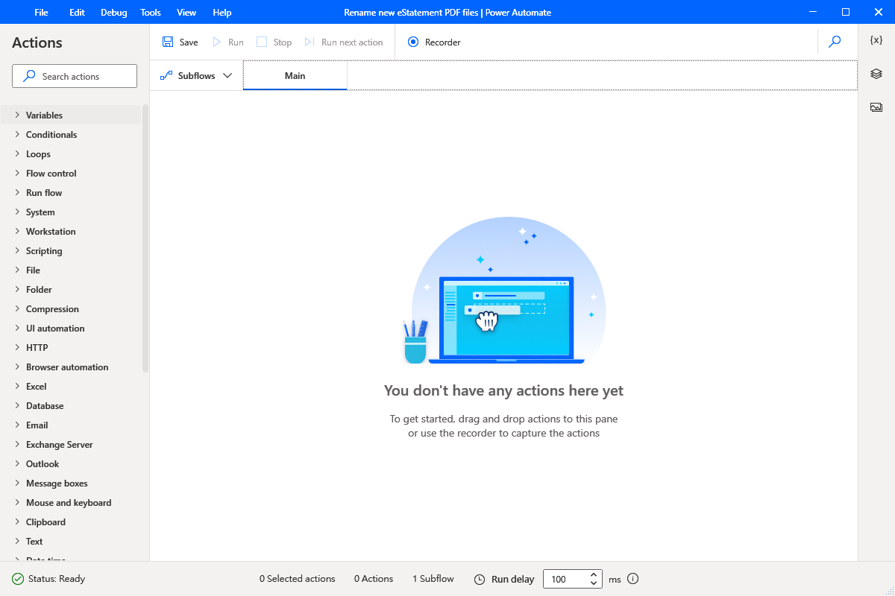
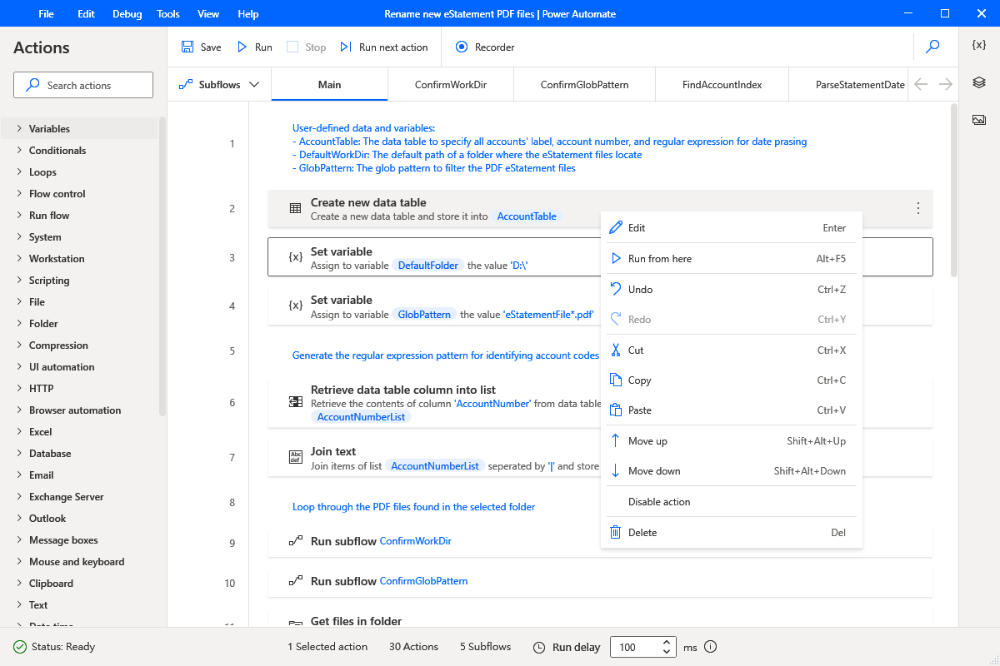
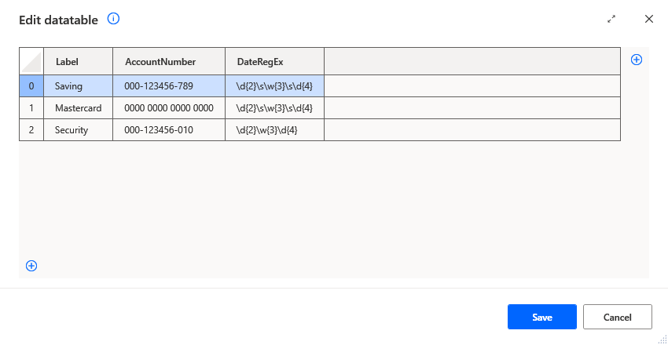
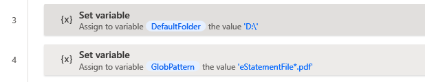
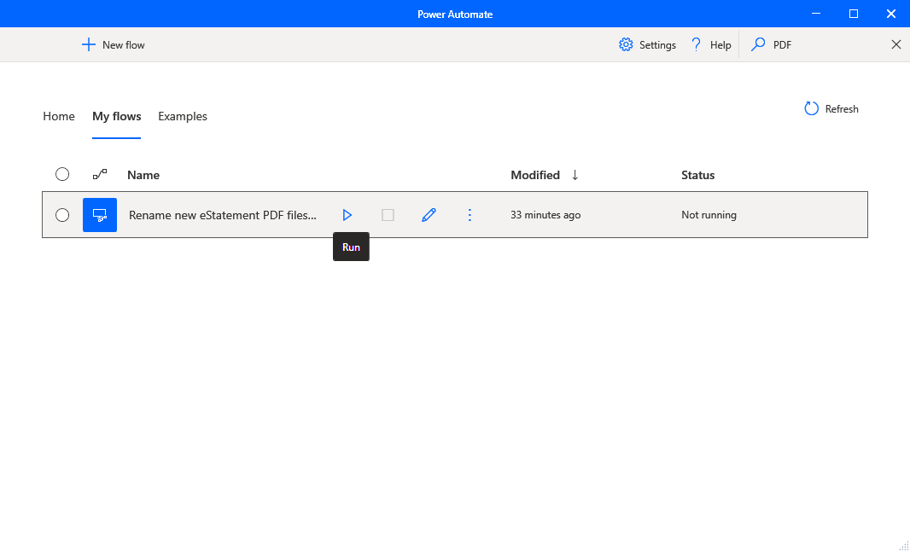
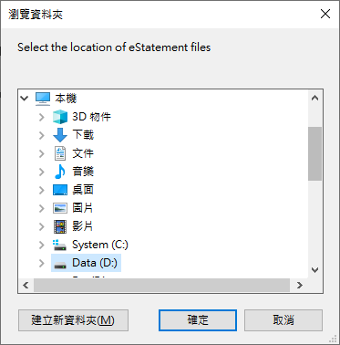
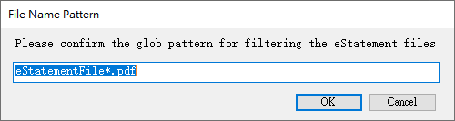

# Power Automate Desktop Flow For Renaming Bank eStatement PDFs

This project provides a [Power Automate Desktop](https://learn.microsoft.com/en-us/power-automate/desktop-flows/getting-started-msa) flow that helps you standardize the PDF filename your banking and credit card eStatements. You can specify a folder location and a glob pattern to find the files you want to rename. The desktop flow will extract the statement type and date from the PDF text. Finally, it will use them to create a new file name in the format of `yyyy-MM_label.pdf`, where `yyyy` is the year, `MM` is the month, and `label` represents the account or statement type.

**Screenshots**:

|  |  |
| :-------------------------------: | :-----------------------------: |
|              Before               |              After              |

## Setup

To set up the desktop flow, follow these steps:

1. Create a new flow in Power Automate Desktop.

   

2. Copy the code in `Main.robin` to your clipboard, and paste it to the **Main** subflow in your flow designer workspace.

   

3. For each of the remaining scripts, add a new subflow by selecting the subflows tab, clicking **+**, and entering the script name as the subflow name. Then, copy and paste the script to the subflow.

   

4. Edit the **Create new data table** action at the beginning of the **Main** subflow, and add a new row for each bank/credit card account that you want to process. Fill in the values of `Label`, `AccountNumber` and `DateRegEx` columns for each row.

   

   | Column name     | Description                                                                                  |
   | --------------- | -------------------------------------------------------------------------------------------- |
   | `Label`         | Enter a string that will use in the new file name to represent the account or statement type |
   | `AccountNumber` | Enter an account number that matches the one printed in the PDF file                         |
   | `DateRegEx`     | Enter a regular expression pattern to parse the statement date from the PDF text             |

   

5. Modify the values of `DefaultFolder` and `GlobPattern` variables to suit your needs.

   

6. Save the flow by selecting **File** in the flow designer’s menu bar and then choosing **Save**. You can also use the keyboard shortcut **Ctrl + S**.

7. Run the flow to test that it works as expected by selecting **Run**.

## Usage

To use the desktop flow, follow these steps:

1. Open your Power Automate Desktop console and select the flow.

   

2. Click the **Run** button either on the command bar or next to the selected flow.
3. Choose the folder where the files you want to rename are located.

   

4. Verify the glob pattern that is used to filter the target PDF files.

    

## Disclaimers

The scripts in this project are generated by copying and pasting the actions of desktop flows from Power Automate Desktop. They use **Robin**, a special programming language for Robotic Process Automation (RPA). You can find more information about Robin language at [the official GitHub repository](https://github.com/robin-language/robin).

## License

The project is licensed under the GPL v3 license. See the [License](/LICENSE) file for details.
